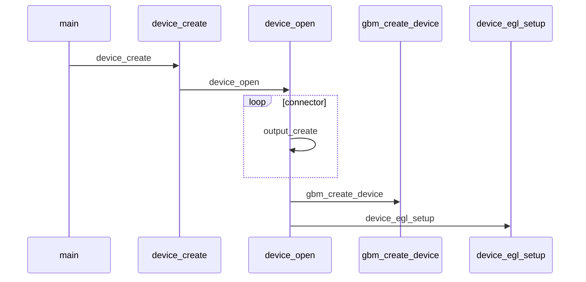
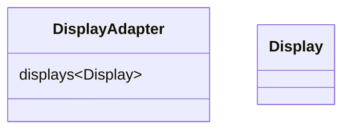

# glplay

##Original Flow

EGL is not is not fully formed yet. Currently its just a collection of functions. These functions are used by `DisplayAdapter`

Currently working through the call flow `device_create` -> `device_open` -> `device_egl_setup`
Next we need to crr

##Overview of new Structure

